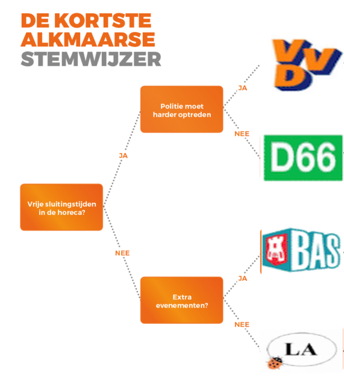

> Volgende opgave was de vaardigheidsproefopdracht voor het 2e zit examen van dit vak (Programming Principles) in augustus 2019

# Introductie

De verkiezingen komen er aan in Nederland. Jouw bedrijf werd ingeroepen om een applicatie te maken die de burger kan gebruiken om te ontdekken op welke partij hij het best kan stemmen. Je gaat dus een zogenaamde stemwijzer maken.

# Fase 0: Wie ben je? (2 punten)

Het programma bestaat uit een loop die telkens uit volgende stappen bestaat:

* Fase 1: **Identificatie**: vragen wie de gebruiker is en op welke partij hij vorig jaar stemde mbv VraagDetails-methode.
* Fase 2: **Stemwijzer** starten: de gebruiker doorloopt enkele vragen om te zien op welke partij hij. Met behulp van de StemWijzer-methode.
* Fase 3: **Statistieken** tonen: gebaseerd op de stemwijzer resultaten van de vorige fase wordt getoond hoe het resultaat zich verhoud tegenover de resultaten van iedereen die de test reeds heeft afgelegd. Met behulp van de ToonStatistieken-methode.


Iedere fase (1,2&3) bestaat uit een methode die vanuit deze fase 0 wordt opgeroepen. De fase 0 loop stopt nooit.

Twee arrays houden volgende informatie bij en worden aangevuld naarmate de informatie beschikbaar is:

* **Naamarray**: 1 array houdt de naam van iedere persoon die de tool heeft gebruikt
* **Resultaatarray**: 1 array houdt het stemresultaat uit fase 2 van de persoon bij

Beide array werken dus synchroon: op dezelfde index staat steeds de naam en stemresultaat van 1 persoon.[kies zelf of je arrays of lists gebruikt]

# Fase 1: identificatie (3 punten)

Maak een methode “VraagDetails”. Deze methode vereist 2 parameters:
* namelijk de array met de namen uit fase 0 (naamarray).
* De kleur (ConsoleColor) waarin de boodschap in de methode moet getoond worden op het scherm. De standaardkleur is Red.

De methode vraagt de naam van de gebruiker (in de kleur die werd meegegeven) en voegt die aan de array toe op de eerste lege plek.

Indien de naam reeds voorkomt in de array verschijnt er een foutboodschap en wordt de naam opnieuw gevraagd. Dit blijft gevraagd worden tot de gebruiker een geldige naam (of "admin") invoert

De methode geeft een bool terug als volgt:

* True indien de gebruiker de naam "admin" heeft ingegeven
* False in alle andere gevallen
 
# Fase 2.1: Welke partij past bij je? (2 punten)
Maak een methode “Stemwijzer”, deze methode vereist 2 parameters van het type bool en ConsoleColor. De Methode geeft een string terug als resultaat.

De eerste parameter die je moet meegeven is een bool die aangeeft of het om een admin gaat of niet. De standaard waarde van deze parameter is false (zie fase 2.3 ivm het gebruik van deze parameter).

De tweede parameter is wederom de kleur waarmee de tekst in de methode zal getoond worden. 

Wanneer de methode opstart wordt er een reeks vragen gesteld. Afhankelijk van het vorige antwoord krijg je andere vragen. Je dient volgende beslissingsboom in te voeren, startende aan de linkerkant:
 


De eerste vraag zal dus zijn “Vrije sluitingstijden in de horeca”. De volgende vraag zal zijn Extra evenementen?” als bij de vorige vraag “neen” werd geantwoord, anders is de volgende vraag “Politie moet harder optreden”

* De gebruiker mag enkel “ja” of “nee” antwoorden.
* Je houdt bij hoe vaak de gebruiker ja  heeft geantwoord, en hoe vaak er nee werd geantwoord. [x] en [y]
* Indien de gebruiker een niet geldige invoer geeft dan zal de vraag opnieuw gesteld worden tot hij correct (ja,nee) invoert.


Het scherm wordt na de vragen leeggemaakt en in het midden van het consolescherm komt de tekst:
``De partij waar je best op stemt is [uitgekomen partij] je hebt hiervoor [x] keer ja geantwoord en [y] keer nee``


# Fase 2.2: Resultaat bewaren (2 punten)
De  methode geeft vervolgens de partij als string terug waar de stemwijzer is op uitgekomen.

Enkel indien de gebruiker géén admin is (wat je hebt teruggekregen via de bool in van VraagDetails() methode wordt vervolgens z’n stemresultaat bewaard in de array 2: Dit resultaat wordt in de 2e array van fase 0 bewaard op de respectievelijke index waar ook de naam van de huidige gebruiker in de andere array staat. 
 

6	Fase 2.3: Stemwijzer tester (3 punten)
Wanneer de gebruiker in fase 1 als admin werd gedetecteerd dan zal de applicatie zelf ja/nee antwoorden op alle vragen (ook de eerste) in fase 2.1. (adminmode geef je aan door de bool als true mee te geven aan de StemWijzer methode). 
 
De applicatie zal de stemwijzer willekeurig invullen (dus random j/n genereren). Deze resultaten worden niet in de arrays bewaard.

Bij een gewone gebruiker wordt de StemWijzer methode met de kleur "green" aangeroepen. Bij een admin "red".

# Fase 3:Statistieken tonen (3 punten)

Als laatste fase wordt een methode ``ToonStatistieken`` aangeroepen. Deze methode verwacht twee arrays. De eerste array bevat namen (string), de andere de stemresultaten (string of enum als je de volgende fase ook maakt).

De methode gebruikt de 2 arrays om enkele interessante statistieken te tonen:
1.	Het toont het percentage dat partijen vertegenwoordigd zijn. Als dus de array bestaat uit vvd,d66,vvd. Dan zal vvd 66% vertegenwoordigen, d66 33%
2.	Je toont ook het aantal keer dat iedere partij voorkwam aan de hand van een lijn bestaande uit zoveel sterren. Als vvd 5 stemmen kreeg, d66 3 en bas 6 dan toont de methode dit als volgt:
```text
vvd ******
d66 ***
bas *****
```
3.	Het toont de gemiddelde lengte van de gebruiker. Als de namen bestaan uit Tim,Jos,Frederik, Frans dan is dit gemiddelde 4,75 letters
4.	Het geeft een overzicht van alle stemresultaten maar toont enkel de eerste letter van iedere naam. Als bijvoorbeeld Tom op d66 uitkwam, Gerolf op vvd en Frans op bas dan verschijnt er:
    ```text
	T, d66
	G, vvd
	F, bas
    ```


# Extra: Enum (2 punten)
Gebruik een enum type om de partijen voor te stellen in je code en vervang ook de array door een array die die enums kan bevatten in plaats van strings voor de partijen.
