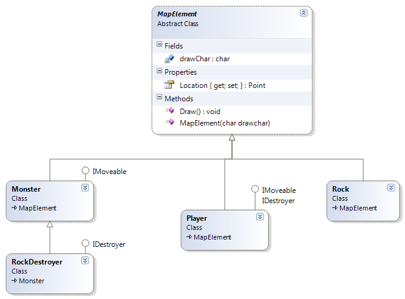
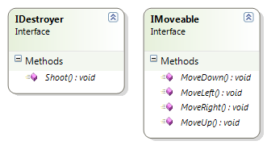
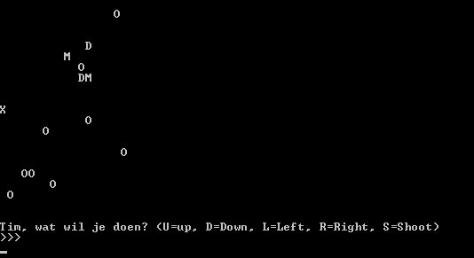

# Labo-oefeningen

## Oefening: H16-figuren-met-interfaces
### Leerdoelen
* verschillende klassen groeperen met een gemeenschappelijke interface
* werken met lijsten van onbepaalde lengte

### Functionele analyse
Dit programma toont de oppervlakte van een reeks vormen.

### Technische analyse
#### UI
console applicatie
#### voorbeeldinteractie(s)
```
Een rechthoek met een breedte van 2.2m en een hoogte van 1.5 m heeft een oppervlakte van 3.3m².
Een rechthoek met een breedte van 3m en een hoogte van 1 m heeft een oppervlakte van 3m².
Een driehoek met een basis van 3m en een hoogte van 1 m heeft een oppervlakte van 1.5m².
Een driehoek met een basis van 2m en een hoogte van 2 m heeft een oppervlakte van 2m².
```

### Technische hulp
#### Programmaverloop
Zoals in hoofdstuk 8 worden er vaste vormen aangemaakt, maar er wordt geen variabele voorzien voor elke vorm. In plaats daarvan wordt elke vorm in een `List<IShape>` geplaatst. `IShape` is een interface voor allerlei soorten vormen. Alle vormen hebben gemeenschappelijk dat hun oppervlakte berekend kan worden, dus dit gedrag wordt deel van de interface.

#### Testscenario's
* Test uit dat je geen enkele afmeting kleiner kan maken dan 1, of het nu gaat om rechthoeken of driehoeken.
* Test uit met de figuren beschreven in de voorbeeldinteractie.

## Mapmaker afwerken

Vervolledig het all-in-project "[Map Maker](../../semester-2-appendix/all-in-projecten/1_mapmapker.md)". Inclusief interfaces en is/as .Kan je zelf extra zaken toevoegen zoals andere kamers, andere functionaliteit, etc.

## Game

**Zie onderaan pagina voor minimale klasse-hiërarchie en interfaces.**

Maak een spel dat als volgt werkt:

* De speler dient met zijn pion de overkant van het veld te bereiken.
* Het veld bestaat uit 20 bij 20 vakjes. Op ieder vakje kan maximum één mapelement staan: 
  * De speler zelf
  * Een monster
* Een rots
* Een speler kan niet door rotsen of monsters wandelen. 
* Een speler kan in zijn beurt telkens één vakje bewegen OF naar rechts schieten:
  * Indien geschoten wordt dan zal het mapelement op het vakje rechts van de speler vernietigd worden \(rots of monster\)
* Monsters kunnen ook bewegen. In de beurt van de monsters beweegt ieder monster in een willekeurige richting indien er geen rotsen of spelers LINKS van het monster staan.
  * Indien er WEL een rots of speler LINKS van het monster staat dan schiet het monster en vernietigd het de speler of rots.
* Enkel RockDestroyer monsters kunnen schieten.

  De setup van het spel bestaat uit volgende stappen:

* Maak een 20 bij 20 array aan en plaats bepaalde hoeveelheid monsters en rotsen op de kaart, behalve op kolom 0.
* Plaats de speler op de plek 0,10 in de array \(midden van kolom 0\)
* Doorloop de volgende stappen tot er winnaar is

Iedere beurt van het spel bestaat uit volgende stappen: 1. Vraag speler om input \(bewegen in 1 van de 4 richtingen OF schieten\) 2. Voer actie van speler uit 3. Kijk of speler overkant van kaart heeft bereikt, zo ja: gewonnen! 4. Beweeg ieder monster op de kaart in een willekeurige richting 5. Beweeg iedere RockDestroyer OF laat RockDestroyer schieten

Stel de speler voor door een X, een rots door O , een monster door M een RockDestroyer door D.

### Extra’s:

Voorgaande beschrijving is een ‘minimale’ beschrijving. Voorzie extra functionaliteit naar believen zoals:

* Speler heeft levens
* Monsters hebben levens
* Andere soort monsters \(bv slimmere\)
* Meerdere levels met telkens andere/meer monsters bijvoorbeeld
* Meerdere spelers
* Verder schieten, of schieten in andere richtingen.

### Klasse-schema



`Location` is van het type `Point` \(compositie\). `Point` is een zelfgemaakte mini klasse die er als volgt uit \(minimaal uitziet\):

```csharp
class Point
{
  public int X{get;set;}
  public int Y{get;set;}
}
```

En dus in je abstracte klasse MapElement zal iets krijgen in de trend van: `public Point Location {get;set;} = new Point();`

### Enkele screenshots

 

